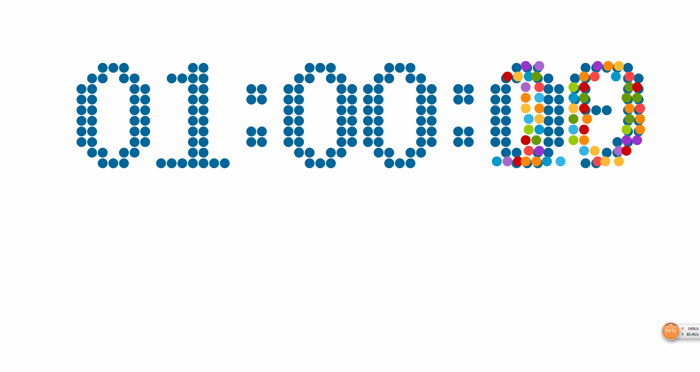

# countdown

使用 canvas 实现一款酷炫的倒计时web应用  

## 介绍  

主要功能 : 倒计时  
特点 :  

1. 用小球绘制数字  
2. 当时间变化，数字对应的小球进行散落  
3. 小球弹跳  

看起来很酷炫 ...  

## 使用  

### 基本使用  

下载， 然后双击 `index.html`  
(**默认是距离当前时间 1 小时 10 分钟倒计时**)  

### 自定义倒计时时间  

1. 打开 `index.js`, 找到 `timeStop`, 修改其值来自定义倒计时时间 :  

		timeStop = {
			hours: 1,	// 设置小时数， 要求 : <=99
			miniutes: 0, // 设置分钟数, 要求 : <=59
			seconds: 10 // 设置秒数, 要求 : <=59
		}

2. 双击 `index.html`, 就可以开始距当前时间 `timeStop.hours` 小时, `timeStop.miniutes` 分钟, `timeStops.seconds` 秒的倒计时  

## Todo

- [X] 用小球来绘制数字
- [X] 小球绘制截止时间
- [X] 开始进行倒计时
- [X] 添加小球落下实验 ： 完成小球落下
- [X] 小球落下实验： 碰撞检测
- [X] 小球落下实验： 增加阻力, 添加摩擦参数  
- [X] 时间变换，小球出现
- [X] 性能优化 : 去掉出现在屏幕之外的小球
- [X] 屏幕自适应
- [X] 修复屏幕自适应的bug 并可以方便自定义 **停止时间**
